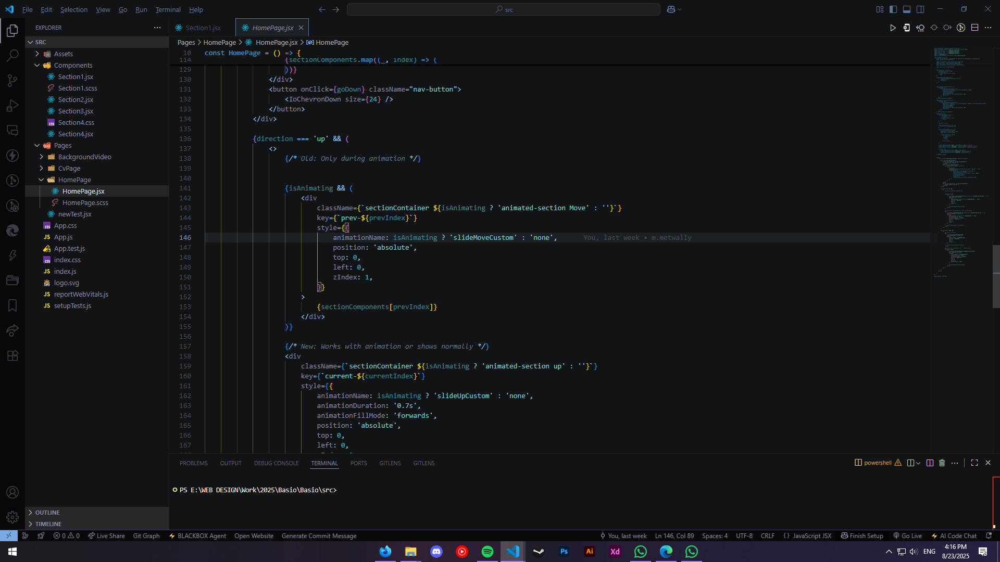

# Ethereal Nexus - VS Code Theme Collection

© 2025 Mohamed Metwally  

**Website:** [https://mohammed-metwally.web.app/](https://mohammed-metwally.web.app/)  
**Issues / Extension Repository:** [https://github.com/Mo-metwally/Ethereal-Nexus/issues](https://github.com/Mo-metwally/Ethereal-Nexus/issues)  

---

## Overview
**Ethereal Nexus** is a dark, immersive VS Code theme collection developed by **Mohamed Metwally**.  
It blends deep black backgrounds with six mystical hues:

- Rosewood Ember  
- Sandstone Whisper  
- Moonlit Frost  
- Ethereal Mist  
- Willow Wisp  
- Sunlit Aura  

This collection is designed to create a visually appealing, consistent, and readable coding environment.

---

## Theme Previews

  
  
  
  
  
  
  
  
  

---

## Notes on Code Usage
- Some code for **editor line color changes** is adapted from the **Dark One Pro** theme.  
  - Usage is **limited** and only applies to certain themes within this collection.  
- All other theme definitions and customizations are **original** or derived from VS Code's **default open-source themes**.

---

## License
Permission is hereby granted, **free of charge**, to any person obtaining a copy of this extension and associated files, to use, copy, modify, and distribute the extension, **subject to the following conditions**:

1. Appropriate credit must be given to the original authors where applicable.  
2. Any redistribution must include this LICENSE file.  
3. You may **not claim this extension as your own work** if using parts from "Dark One Pro".  

**THE EXTENSION IS PROVIDED "AS IS", WITHOUT WARRANTY OF ANY KIND.**

---

## Metadata
```json
{
    "@id": "m-metwally.ethereal-nexus",
    "displayName": "Ethereal Nexus",
    "description": "Ethereal Nexus is a dark, immersive theme collection blending deep black backgrounds with six mystical hues: Rosewood Ember, Sandstone Whisper, Moonlit Frost, Ethereal Mist, Willow Wisp, and Sunlit Aura."
}
